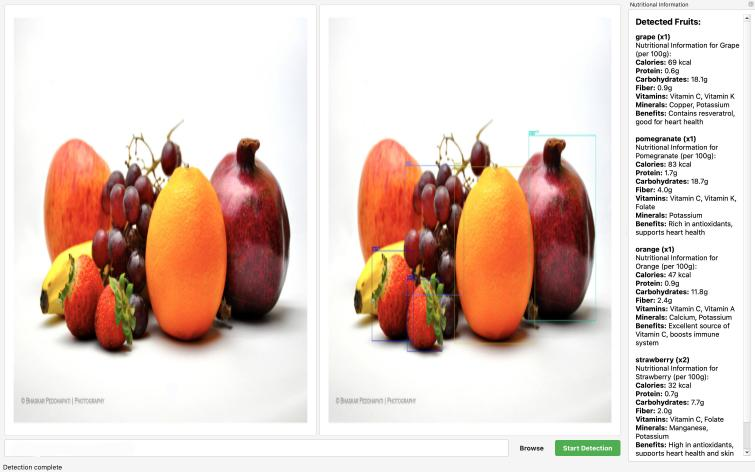

# Trabalho CP3 - Exploração de Ferramenta de Visão Computacional (YOLO)

## Instituição

- **Instituto Politécnico de Viana do Castelo - Escola Superior de Tecnologia e Gestão (IPVC - ESTG)**

## Docentes Orientadores

- **Professor Doutor Jorge Ribeiro**

- **Professor Doutor Abel Dantas**

## Unidade Curricular

- **Aprendizagem Organizacional**

## Ano Letivo

- **2024/2025**

## Aluno

- **Luís Vale do Carmo**, Aluno N.º29341

## Descrição do Projecto

Este projeto implementa um detetor de frutas utilizando YOLOv5 com uma interface gráfica intuitiva desenvolvida em PySide6. A aplicação permite o processamento de imagens e vídeos para deteção automática de frutas.

## Contribuição Desenvolvida

A principal contribuição deste trabalho foi a integração de informação nutricional ao sistema de deteção original. Foi desenvolvido um módulo que fornece dados nutricionais detalhados (calorias, vitaminas, minerais, etc.) para cada fruta detetada, enriquecendo significativamente a funcionalidade da aplicação base.



## Configuração do Ambiente

### Pré-requisitos

- **Sistema Operativo**: Linux ou Windows (recomendamos Linux para melhor desempenho)
- **Python**: Versão 3.6 ou superior
- **PyTorch**: Versão 1.7 ou superior

### Instruções de Configuração

1. Clone o repositório:
   ```bash
   git clone https://github.com/luisvc004/CP3A_Fruit-Detector.git
   
   cd CP3A_Fruit-Detector
   ```
   
2. Instale as dependências necessárias:
    ```bash
   pip install -r requirements.txt
    ```

3. Descarregue o modelo treinado:

- Faça o download através deste link: [Modelo YOLOv5 Fruits](https://drive.google.com/file/d/1W6qZeutnqnp3YX9w4iYgR44xsoi_64ff/view?usp=sharing)
- Coloque o ficheiro descarregado no diretório `weights/`

4. Execute a aplicação:

```bash
python main.py
```

## Configuração Local (Ambiente Virtual)

Para uma instalação isolada utilizando ambiente virtual (recomendado para Mac):

```bash
# Criar ambiente virtual
python3 -m venv venv

# Ativar ambiente virtual
source venv/bin/activate  # Linux/Mac
# ou
venv\Scripts\activate     # Windows

# Instalar dependências
pip install -r requirements.txt

# Executar aplicação
python3 main.py
```

## Funcionalidades

A interface gráfica permite:

- Selecionar imagens ou vídeos para processamento
- Visualizar as deteções em tempo real
- **Consultar informação nutricional detalhada** das frutas detetadas (funcionalidade desenvolvida)

## Dataset

O conjunto de dados utilizado para treino está disponível [aqui](https://t.ly/NZWj).

## Resolução de Problemas

- **Mac/Linux**: Utilize preferencialmente o método de instalação com ambiente virtual
- **Problemas de dependências**: Certifique-se de que tem Python 3.6+ e PyTorch 1.7+ instalados
- **Erro ao carregar modelo**: Verifique se o ficheiro do modelo está no diretório `weights/`

## Contribuições

Este projeto foi desenvolvido com base no YOLOv5 e adaptado para deteção específica de frutas com funcionalidades de informação nutricional.


curl https://ollama.ai/install.sh | sh
ollama pull mistral
ollama serve
OLLAMA_HOST=127.0.0.1:11435 ollama serve