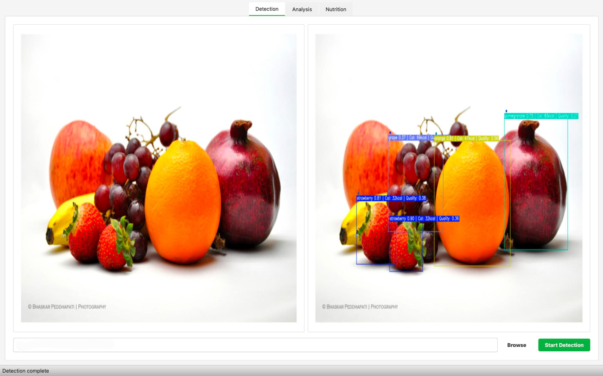
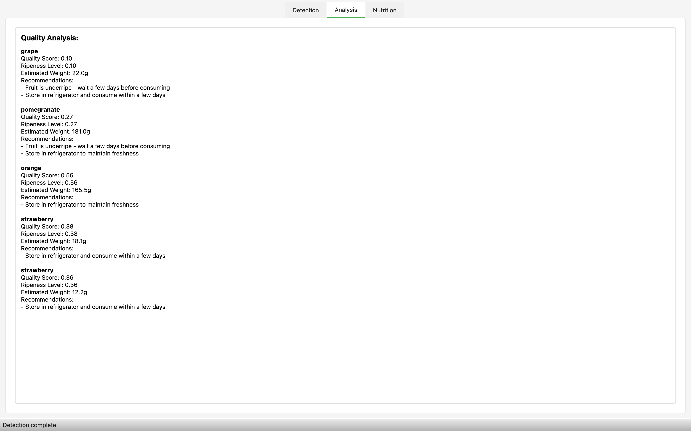
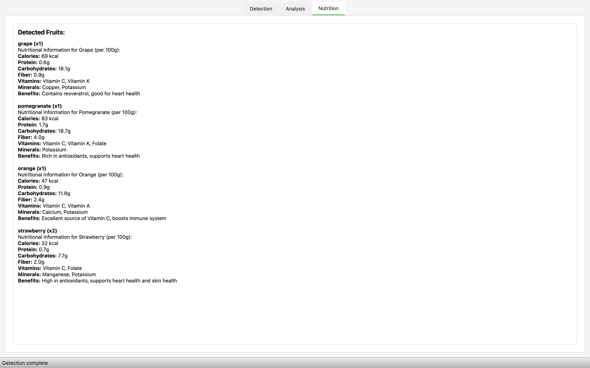

# Trabalho CP3B - Exploração de Ferramenta de IA Generativa

## Instituição

- **Instituto Politécnico de Viana do Castelo - Escola Superior de Tecnologia e Gestão (IPVC - ESTG)**

## Docentes Orientadores

- **Professor Doutor Jorge Ribeiro**

- **Professor Doutor Abel Dantas**

## Unidade Curricular

- **Aprendizagem Organizacional**

## Ano Letivo

- **2024/2025**

## Aluno

- **Luís Vale do Carmo**, Aluno N.º29341

## Descrição do Projecto

Este projeto implementa um detetor de frutas utilizando YOLOv5 com uma interface gráfica intuitiva desenvolvida em PySide6. A aplicação permite o processamento de imagens e vídeos para deteção automática de frutas, análise de qualidade e informação nutricional detalhada.

## Funcionalidades Principais

A principal contribuição deste trabalho foi a integração de informação nutricional ao sistema de deteção original através de **IA Generativa**. Foi desenvolvido um módulo que utiliza a **API do Llama (via Ollama)** para gerar informações nutricionais detalhadas e dinâmicas para cada fruta detetada. Além disso, foi implementado um **sistema de síntese de voz (Text-to-Speech)** que permite aos utilizadores ouvir as informações geradas em formato de áudio, tornando a aplicação mais acessível e interativa.

## Principais Funcionalidades Adicionadas:

- **Integração com IA Generativa**: Utilização do modelo Llama para gerar informações nutricionais personalizadas
- **Sistema Text-to-Speech**: Conversão de texto para áudio para melhor acessibilidade
- **Interface Dinâmica**: Informações geradas em tempo real baseadas na deteção

2. **Análise de Qualidade**
   - Avaliação do nível de maturação
   - Deteção de defeitos
   - Estimativa de peso
   - Recomendações de armazenamento

3. **Informação Nutricional**
   - Calorias
   - Proteínas
   - Carboidratos
   - Fibras
   - Vitaminas

4. **Interface Intuitiva**
   - Visualização lado a lado (imagem original/deteção)
   - Abas para análise detalhada
   - Geração de relatórios em PDF

## Screenshots

### 1. Interface Principal


### 2. Análise de Qualidade


### 3. Informação Nutricional


### 4. Relatório Detalhado
O sistema gera automaticamente um relatório em PDF contendo:
- Imagem analisada com as deteções
- Tabela resumo com todas as frutas detetadas
- Análise detalhada de cada fruta:
  - Nível de maturação
  - Qualidade
  - Peso estimado
  - Defeitos detetados
  - Recomendações de armazenamento
- Informação nutricional completa
- Data e hora da análise

[Ver exemplo de relatório (PDF)](reports/fruit_analysis_20250601_181514.pdf)

## Configuração do Ambiente

### Pré-requisitos

- **Sistema Operativo**: Linux ou Windows (recomendamos Linux para melhor desempenho)
- **Python**: Versão 3.8 ou superior
- **PyTorch**: Versão 1.7 ou superior
- **Ollama**: Para execução local do modelo Llama

### Instruções de Configuração

1. Clone o repositório:
   ```bash
   git clone https://github.com/luisvc004/CP3A_Fruit-Detector.git
   
   cd CP3A_Fruit-Detector
   ```

2. Configuração do Ollama (IA Generativa)

    Escolha o seu Sistema Operativo para instalar o Ollama:

   **Opção 1 - Terminal (Linux/macOS)**:

   ```bash
   curl https://ollama.ai/install.sh | sh
   ```   

   **Opção 2 - Interface Gráfica (Todos os sistemas)**:
   
   1. Vá até [Download Ollama](https://ollama.ai/download)
   2. Escolha o seu Sistema Operativo e clique no botão de download
   3. Instale o pacote descarregado e siga as instruções

    **Após a instalação, configure o modelo (todos os sistemas)**:

    ```bash
    # Descarregar o modelo Mistral
    ollama pull mistral
    
    # Iniciar o servidor Ollama
    ollama serve
    
    # Para configuração específica de host (se necessário):
    OLLAMA_HOST=127.0.0.1:11435 ollama serve
    ```
3. Instale as dependências necessárias:
    ```bash
   pip install -r requirements.txt
    ```

4. Descarregue o modelo treinado:

- Faça o download através deste link: [Modelo YOLOv5 Fruits](https://drive.google.com/file/d/1W6qZeutnqnp3YX9w4iYgR44xsoi_64ff/view?usp=sharing)
- Coloque o ficheiro descarregado no diretório `weights/`

5. Execute a aplicação:

```bash
python main.py
```

## Configuração Local (Ambiente Virtual)

Para uma instalação isolada utilizando ambiente virtual (recomendado):

```bash
# Criar ambiente virtual
python3 -m venv venv

# Ativar ambiente virtual
source venv/bin/activate  # Linux/Mac
# ou
venv\Scripts\activate     # Windows

# Instalar dependências
pip install -r requirements.txt

# Executar aplicação
python3 main.py
```

## Funcionalidades

A interface gráfica permite:

- Selecionar imagens ou vídeos para processamento
- Visualizar as deteções em tempo real
- **Consultar informação nutricional gerada dinamicamente** através de IA Generativa (Llama)
- **Ouvir as informações em áudio** através do sistema Text-to-Speech integrado
- **Interação mais rica e personalizada** com conteúdo gerado em tempo real

## Dataset

O conjunto de dados utilizado para treino está disponível [aqui](https://t.ly/NZWj).

## Resolução de Problemas

### Problemas Gerais

- **Mac/Linux**: Utilize preferencialmente o método de instalação com ambiente virtual
- **Problemas de dependências**: Certifique-se de que tem Python 3.8+ e PyTorch 1.7+ instalados
- **Erro ao carregar modelo**: Verifique se o ficheiro do modelo está no diretório `weights/`

### Problemas com Ollama

- **Servidor não responde**: Verifique se o comando `ollama serve` está em execução
- **Modelo não encontrado**: Execute `ollama pull mistral` para descarregar o modelo
- **Problemas de conexão**: Verifique se a porta 11434 (padrão) está disponível

## Contribuições

Este projeto foi desenvolvido com base no YOLOv5 e adaptado para deteção específica de frutas, incluindo:
- Análise de qualidade e maturação
- Informação nutricional detalhada
- Interface gráfica intuitiva
- Geração de relatórios em PDF